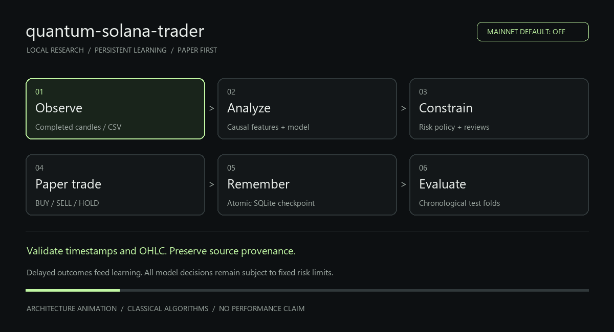
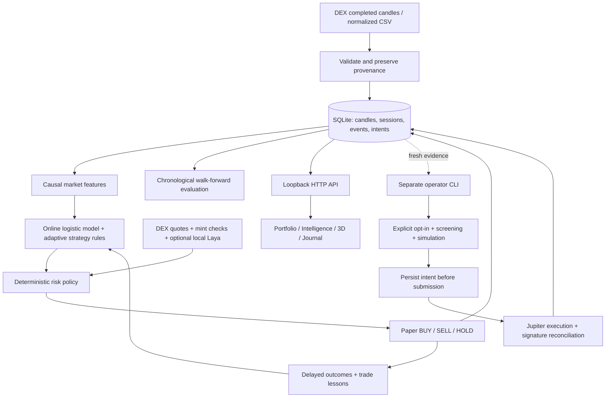

# quantum-solana-trader

**A local SOL/USDC research and paper-trading agent with persistent learning, auditable decisions and an interactive 3D dashboard.**

Python + SQLite + native JavaScript. CPU-only. No GPU, wallet, cloud database or paid API is needed for the default workflow.

> **Status: research / paper trading.** Mainnet is disabled by default. No profitable edge has been established. The dashboard cannot sign transactions, and no unattended mainnet loop exists. “Quantum” is the project name: the current implementation uses **classical algorithms**, not quantum computation or quantum-inspired optimization.



*An architecture animation, not a recording of trades or performance. [Static image](docs/media/architecture.png). Both assets live in this repository and render on GitHub.*

## What is implemented?

| Capability | Current behavior |
|---|---|
| Market | SOL/USDC spot; long or cash; no shorts or leverage |
| Historical data | Keyless GeckoTerminal DEX candles; explicit legacy Binance and CSV research |
| Local learning | Online logistic regression plus adaptive momentum, mean-reversion and breakout rules |
| Evaluation | Three expanding chronological training/test folds, embargo and delayed labels |
| Execution | Simulated fills with fees, slippage and gas assumptions |
| Memory | Atomic SQLite checkpoints for models, accounts, risk state, pending labels and events |
| Risk | Position/daily-loss/drawdown limits, stops, cooldowns, drift/stale-data checks and kill switch |
| Token screening | Mint/program/authority/concentration/quote checks; unknown assets remain blocked |
| DEX research | Orca/Raydium/Meteora pool comparison and size-specific Raydium round-trip quotes; no atomic arbitrage executor |
| Local Laya | Optional CPU risk-review adapter; requires downloaded weights; actual inference not yet verified |
| Jev | Optional hosted reviewer, blocked by default even if an API key is present |
| Mainnet | Restricted supervised CLI adapter; unvalidated with real funds |

The dashboard has four views:

1. **Portfolio:** equity, open exposure, PnL, win/loss statistics and searchable/filterable fills.
2. **Intelligence:** training stages, evaluation, prediction baselines, readiness checks and decision ledger.
3. **Neural space:** draggable/zoomable 3D signal network, keyboard controls and reduced-motion support.
4. **Event journal:** searchable logs, older events and JSONL export.

CPU, RAM, disk and uptime telemetry remain visible. `psutil` enables complete telemetry; the research engine uses Python's standard library.

## Requirements

- Python **3.11+**, Git and a modern browser.
- Recommended: i5-class CPU, 16–32 GB RAM and an SSD. No GPU required.
- Internet access for market downloads/live observations. Synthetic demos work offline.
- Free disk space for growing logs and checkpoints; no automatic retention policy is installed.

## Install on Ubuntu

```bash
# Install these only if missing. Use a supported Ubuntu/Python version.
sudo apt update
sudo apt install git python3 python3-venv

git clone https://github.com/Web3AirdropsArena/quantum-solana-trader.git
cd quantum-solana-trader
python3 -m venv .venv
source .venv/bin/activate
python -m pip install -r requirements.txt
python -m unittest discover -s tests -v
python -m quantum_solana_trader serve
```

Open **http://127.0.0.1:8765/**. Keep the terminal running. **Ctrl+C** stops the server. On subsequent starts, enter this directory, activate `.venv` and run the last command. Check `python3 --version` before installing; use a newer supported interpreter if it is below 3.11.

For a dedicated remote Ubuntu machine, use an SSH tunnel from your desktop:

```bash
ssh -L 8765:127.0.0.1:8765 user@ubuntu-host
```

Open the same localhost URL on your desktop. The app binds only to loopback; public hosting and multi-user authentication are not configured.

## Install on Windows

Install Git and Python 3.11+, then run PowerShell:

```powershell
git clone https://github.com/Web3AirdropsArena/quantum-solana-trader.git
cd quantum-solana-trader
py -3 -m venv .venv
.\.venv\Scripts\python.exe -m pip install -r requirements.txt
.\.venv\Scripts\python.exe -m unittest discover -s tests -v
.\.venv\Scripts\python.exe -m quantum_solana_trader serve
```

This does not require changing PowerShell activation policy. In the commands below, replace `python` with `.\.venv\Scripts\python.exe` on Windows if the environment is not activated.

Node.js is **not** required to run the dashboard. Optional `requirements-live.txt` adds Solana signing support for devnet exercises and the supervised adapter. `requirements.lock` lists all runtime pins; it is not a hash-verified lockfile.

## First run: dashboard workflow

1. In **Intelligence**, run the synthetic demo to verify the software pipeline. Synthetic performance cannot qualify for mainnet review.
2. Choose **Download DEX history** to request seven days of public SOL/USDC pool candles. Provider availability may limit the returned history. Select that dataset and choose **Train dataset**.
3. Choose **Evaluate dataset**. Inspect net results, costs, drawdown, calibration, sample size and the no-opportunity baseline. Training accuracy alone is not evidence of success.
4. Select a real replay session to warm-start its model, or start cold. Enter a paper-session name and choose **Start live paper**. Real observations are used, but all capital and fills remain simulated.
5. **Stop worker** retains committed state. Start the same session name later to resume. Worker threads themselves do not survive a process restart.

Only one writer may own a database. Stop the server before using a separate writer CLI, or give that command a different `--db` path. Do not erase failed sessions to make performance look better.

## CLI workflow

```bash
# Offline smoke test in an independent database
python -m quantum_solana_trader --db data/demo.sqlite demo

# Real historical data -> training -> independent chronological evaluation
python -m quantum_solana_trader download --days 30 --interval 1m
python -m quantum_solana_trader train --session initial-training
python -m quantum_solana_trader evaluate --session evaluation-001

# Observe live data with simulated money. Ctrl+C stops cleanly.
python -m quantum_solana_trader paper --session live-dex-paper --checkpoint initial-training
# Resume this account later:
python -m quantum_solana_trader paper --session live-dex-paper
```

Use a fresh prefix for each evaluation. Interrupted evaluation retains partial checkpoints but does not issue a completed report. DEX history currently supports one-minute bars. Warm starts require a replay checkpoint from the exact same pool/source. Legacy CEX research requires explicit `download --provider binance` / `paper --feed binance`; it cannot satisfy DEX mainnet provenance gates.

**No paid model is required.** Core training and inference run locally. Public market APIs require internet but no keys in the default workflow; offline demos and imported CSVs need neither. Mainnet gas and DEX fees still cost money. See [the free workflow, optional Laya setup and wallet handling](docs/FREE_MODE.md).

## Architecture



| File/module | Responsibility |
|---|---|
| `quantum_solana_trader/model.py` | Features, predictions, delayed-label learning, expert weights and drift |
| `quantum_solana_trader/engine.py` | Portfolio accounting, risk policy, decisions, metrics and readiness |
| `quantum_solana_trader/store.py` | Atomic persistence, backup/export and OS writer lock |
| `quantum_solana_trader/providers.py` | Binance, CSV, Solana RPC, Jupiter, screening and Jev adapters |
| `quantum_solana_trader/dex.py` | DEX history, venue comparison and round-trip friction checks |
| `quantum_solana_trader/local_review.py` | Optional offline CPU Laya reviewer; cannot override risk limits |
| `quantum_solana_trader/research.py` | Synthetic data, resumable replay and evaluation |
| `quantum_solana_trader/runtime.py` | Worker lifecycle and resource telemetry |
| `quantum_solana_trader/server.py` | Local HTTP routes, Host/origin checks and CSRF protection |
| `quantum_solana_trader/live.py`, `devnet.py` | Isolated supervised signing and devnet exercise |
| `web/` | Native HTML/CSS/JS dashboard; no frontend build step |
| `tests/` | Behavioral and security-boundary regression checks |

## Which models and strategies are used?

**Online logistic regression** uses six inputs: intercept, normalized recent return, trend, mean reversion, breakout and relative volume. It predicts whether the future return exceeds the modeled fee/slippage hurdle. Predictions are recorded before labels mature, five bars later by default. Training runs locally; there is no downloaded pretrained trading model.

**Adaptive strategy rules** vote using momentum, mean reversion and breakout signals. Exponential weighting updates their contributions from counterfactual net returns. These are transparent baseline hypotheses, not verified proprietary strategies from top traders.

**Risk mathematics** uses EWMA volatility, a short-window empirical tail-loss estimate, capped sizing and drawdown controls. These are classical calculations. The short tail estimate is noisy and cannot protect against every jump or illiquidity event.

**Trade memory** retains realized losses, reduces risk after losses and introduces cooldowns. The model learns numerical parameters; it never rewrites source code or expands policy limits. Logged explanations are observable reasons and checks, not hidden chain-of-thought or a guarantee that failures cannot recur.

**Laya** is an optional local typed-decision reviewer, separate from the trading model. Its weights are not automatically retrained by paper trading. The adapter is tested with controlled responses; real downloaded-checkpoint inference remains unverified. **Jev** is an optional hosted alternative, blocked unless `QST_ALLOW_HOSTED_AI=1` and explicitly selected. Neither is required for the free core. See [setup and primary sources](docs/FREE_MODE.md).

## Default risk policy

Default capital is **10,000 simulated USDC**, not a funded wallet balance.

| Parameter | Default |
|---|---:|
| Maximum allocation | 10% of paper equity |
| Risk budget per trade | 0.5%, before further reductions |
| Daily-loss / drawdown halt | 2% / 8% |
| Stop / target | 2.5% / 5% |
| Fee / adverse slippage | 10 / 15 basis points per side |
| Gas assumption | 0.005 USDC per fill |
| Minimum order | 10 USDC |

Defaults are in `engine.py`; existing sessions retain their saved policy. Evaluate changes in separate sessions. Historical replay fills at the next bar's open; live paper uses the newly observed close. Ambiguous OHLC stop/target ordering is unfavorable. CEX bars cannot reproduce DEX liquidity, MEV, latency or actual fees.

**Pause** blocks new entries while allowing risk exits. **Kill** latches the account and queues a paper exit at the next valid observation. **Stop worker** stops observation without liquidating. None manages a real wallet; exits cannot be guaranteed during feed outages.

Readiness checks require real observation count/duration, enough closed trades, positive PnL, acceptable profit factor/drawdown, no halt/drift and Brier skill above a no-opportunity forecast. Offline waiting does not advance observation duration. Passing these minimum checks never automatically enables mainnet or proves future profitability.

## Memory, backup and moving to Ubuntu

For existing-installation compatibility, the default database remains **`data/astra.sqlite`** after the rename. The old `python -m astra` command remains a compatibility alias. New commands use `python -m quantum_solana_trader`. Existing trained state is preserved.

Choose another database with `--db data/your-name.sqlite` **before** the command. SQLite atomically commits model/account state and events. Logs are unencrypted and have no automatic retention policy.

```bash
python -m quantum_solana_trader backup data/checkpoint-001.sqlite
python -m quantum_solana_trader export --session live-paper --output data/live-paper.jsonl
```

Use new output filenames. Transfer a proper SQLite backup; do not copy a live database without its WAL. Recreate `.venv` on Ubuntu instead of copying the Windows environment. Before upgrading, stop the worker, back up, retain the matching code and verify against a database copy. Incompatible future formats need explicit migration.

CSV header: `ts,open,high,low,close,volume`. Timestamps must be **close-time UTC Unix seconds**; prices must be finite with valid OHLC bounds, and volume nonnegative. Normalize raw Binance archives before import.

## Optional integrations and mainnet boundary

Set secrets in your process environment; never commit them or enter them in the dashboard. The app **does not automatically load `.env` files**.

| Variable | Purpose |
|---|---|
| `QST_ALLOW_HOSTED_AI` | Leave unset/0 for the default no-hosted-model policy |
| `TYPESAFE_API_KEY` | Hosted Jev; also requires the above switch and per-run `--jev` |
| `QST_LAYA_MODEL_DIR` | Optional complete local Laya checkpoint directory |
| `QST_WALLET_FILE` | Path to an external owner-only Ubuntu keyfile; never the key itself |
| `JUPITER_API_KEY` | Supervised swap adapter only; unnecessary for default paper mode |
| `SOLANA_RPC_URL` | Optional HTTPS mainnet RPC |
| `QST_MAINNET` | Explicit CLI-only switch; leave unset for research |

Jev use can incur provider charges. The adapter sends features/policy context, never a keypair. Invalid, uncertain or unavailable enabled reviewers block entries. Without keys, public-data paper mode still works. Authenticated Jev/Jupiter verification remains outstanding.

The supervised mainnet adapter requires explicit configuration, acknowledgment, fresh evidence, a separate keyfile, screening, simulation and durable intent reconciliation. Orders are capped at 25 USDC and daily gross turnover at 100 USDC. It rejects lookup-table routes and many normal swaps. It has **not** been validated with real funds. Unknown-token trading and unattended mainnet execution are not implemented. Do not fund it based on build completion.

## Command reference

Run `python -m quantum_solana_trader --help` or append `--help` to a subcommand.

| Command | Purpose |
|---|---|
| `serve --port 8765` | Local dashboard |
| `demo` | Offline synthetic replay |
| `download --days 30` | Request keyless one-minute DEX history; provider availability applies |
| `scan-dex --usdc 10` | Read-only pool comparison and conservative round-trip quotes |
| `import-csv file.csv --source csv:my-data` | Normalized CSV with provenance |
| `train --session name` | Replay/learn; optional `--source` and `--interval` |
| `evaluate --session fresh-name` | Three-fold evaluation |
| `paper --session name` | Real observations, simulated trades |
| `screen MINT` | Read-only token screening |
| `devnet-check` | Read-only RPC connectivity |
| `devnet-exercise` | Optional faucet/self-transfer; not DEX validation |
| `export` / `backup` | JSONL journal / SQLite backup |
| `reconcile` | Check uncertain submitted signatures without resending |
| `swap` | Restricted supervised adapter; unvalidated for real use |

## Verification and honest results

**37 regression tests** passed on Windows/Python 3.14.7. Run the suite after installation; dedicated Ubuntu hardware validation remains outstanding. Tests include causal predictions, accounting, restart equivalence, failed commits, DEX provenance/pagination, malformed quotes, hosted-AI blocking, local-review validation, uncertainty reconciliation and HTTP boundaries. Live keyless smoke checks retrieved 1,440 DEX candles and compared three venues. A replay made no trades and underperformed the trivial prediction baseline; this validates plumbing, not profitability.

The earlier **Binance research** [full-week report](docs/full-week-evaluation.json) used **10,080 real minute candles**, three expanding training folds and 1,507 test bars per fold. It is not DEX execution evidence:

| Test fold | Paper PnL | Closed trades | Brier skill vs no opportunity |
|---|---:|---:|---:|
| 1 | 0.00 USDC | 0 | +0.0878% |
| 2 | +1.6843 USDC | 1 | +3.3127% |
| 3 | 0.00 USDC | 0 | -1.2918% |

**No profitable edge established.** One profitable trade is insufficient evidence. Two folds did not trade, and the last fold lost to the trivial baseline despite 99.46% accuracy. No thresholds were tuned on these results. Synthetic results are not performance evidence.

Outstanding work: authenticated integrations, complete devnet transaction validation (faucet rejected the earlier request), Ubuntu execution, longer independent market testing and independent review before considering real funds.

## Troubleshooting

| Symptom | Action |
|---|---|
| Cannot open dashboard | Keep the server terminal running and check its printed port |
| Database locked | Stop the other writer or use another `--db` |
| Feed/download fails | Check provider/network access and the journal; do not fabricate data |
| No trades | Inspect warmup, model/expert agreement, costs and risk reasons; HOLD is valid |
| Accuracy looks exceptional | Compare Brier skill, baseline accuracy and actual trades |
| Halted session cannot resume | Review the latched incident; preserve its history |
| Jev disabled | Expected in free mode; paid opt-in additionally requires `QST_ALLOW_HOSTED_AI=1` |
| Unknown swap outcome | Reconcile; never blindly resend or delete intents |

More details: [runbook](docs/RUNBOOK.md) · [audit](docs/AUDIT.md) · [research](docs/RESEARCH.md) · [specification](SPEC.md).

To regenerate the documentation animation, install Pillow in a documentation environment and run `python docs/generate_animation.py`. Pillow is not an application dependency.
